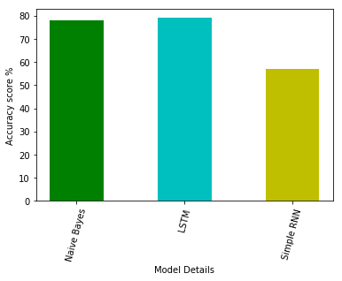
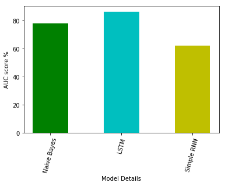

<h2> Introduction </h2>
  Detecting sentiment from a piece of text is a key part of Natural Language Processing (NLP). It is a foundational part of recommender systems which track a user’s affinities and aversions with the aim of matching the user with a product/ service that’s helpful for them.
  
  Most work on sentiment analysis has been done on short-form text data such as those derived from micro-blogging social media sites. Because of the succinct nature of these social media posts, it is perhaps easier to glean points of view than from longer pieces of text. 
  
  I would therefore like to perform sentiment parsing of long-form text in the form of book reviews. The aim is to see if different models are as capable in situations where the user leaves a more verbose review. Book cataloging websites might benefit from insights gained from this project in order to improve their recommendation system. If longer reviews do result in less reliable recommendations the website might decide to implement a word limit on reviews.

<h2> Data Sources </h2>
<li>List of book reviews rated 1 (negative) or 2 (positive). csv file obtained from <a href='https://www.kaggle.com/rakeshkakati/book-reviews'>Kaggle</a>: 2 columns, about 2,800 rows.</li>
<li>List of book reviews rated 1 to 5 scraped from the book reviews aggregator website Goodreads. csv file obtained from <a href='https://www.kaggle.com/san089/goodreads-dataset
'>Kaggle</a>: 2 columns, about 400 rows.</li>

<h2> Repository Navigation </h2>
<ol>
  <li><a href='https://github.com/1njiku/SB-Capstone2/blob/master/Project-Proposal%20.pdf'>Project Proposal</a></li>
  <li><a href='https://github.com/1njiku/SB-Capstone2/blob/master/a.EDA_Preprocessing.ipynb'>EDA and Preprocessing</a></li>
  <li><a href='https://github.com/1njiku/SB-Capstone2/blob/master/Capstone%202%20Milestone%20Report%20.pdf'>Milestone Report</a></li>
  <li><a href='https://github.com/1njiku/SB-Capstone2/blob/master/b.%20Bernoulli_Naive_Bayes.ipynb'>Bernoulli Naive Bayes Model</a></li>
  <li><a href='https://github.com/1njiku/SB-Capstone2/blob/master/c.LSTM.ipynb'>Long Short Term Memory (LSTM) Neural Network</a></li>
  <li><a href='https://github.com/1njiku/SB-Capstone2/blob/master/d.RNN.ipynb'>Recurrent Neural Network</a></li>
  <li><a href='https://github.com/1njiku/SB-Capstone2/blob/master/Capstone%202%20Final%20Report.pdf'>Final Report</a></li>
  <li><a href='https://github.com/1njiku/SB-Capstone2/blob/master/Capstone%202%20Slides.pdf'>TL;DR Slides</a></li>
</ol>

<h2> Results </h2>
The original dataset contained some reviews in other languages including Spanish and Arabic. Preprocessing the text reduced the reviews from a corpus of about 3,000 entries to almost 1,000. The LSTM neural network incorporated more layers and had a regularization layer which probably contributed to its superior performance compared to the simple RNN on a small dataset.

The LSTM neural network had the best performance on accuracy and AUC score followed by the Bernoulli Naive Bayes and the simple RNN neural network. 

<h2> Conclusions </h2>
During preprocessing, I discovered that the dataset had reviews in different languages including Spanish and Arabic and removing these resulted in a smaller corpus to train on. Despite the commendable performance of the LSTM, the simple RNN perhaps could benefit from having a larger training corpus in order to improve performance. 

<h2>Future Scope </h2>
<li> Adding more English language text to train the models</li>

